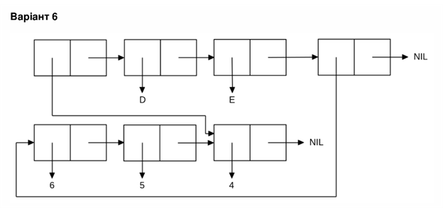

<p align="center"><b>МОНУ НТУУ КПІ ім. Ігоря Сікорського ФПМ СПіСКС</b></p>
<p align="center">
<b>Звіт з лабораторної роботи 1</b><br/>
"Обробка списків з використанням базових функцій"<br/>
дисципліни "Вступ до функціонального програмування"
</p>
<p align="right">Студент: *Левчук Іван Володимирович група КВ-12<p>
<p align="right">Рік: 2024<p>
## Загальне завдання
1.	Створіть список з п'яти елементів, використовуючи функції LIST і CONS . Форма створення списку має бути одна — використання SET чи SETQ (або інших допоміжних форм) для збереження проміжних значень не допускається. Загальна кількість елементів (включно з підсписками та їх елементами) не має перевищувати 10-12 шт. (дуже великий список робити не потрібно). Збережіть створений список у якусь змінну з SET або SETQ . Список має містити (напряму або у підсписках):
•	хоча б один символ
•	хоча б одне число
•	хоча б один не пустий підсписок
•	хоча б один пустий підсписок
2.	Отримайте голову списку.
3.	Отримайте хвіст списку.
4.	Отримайте третій елемент списку.
5.	Отримайте останній елемент списку.
6.	Використайте предикати ATOM та LISTP на різних елементах списку (по 2-3 приклади для кожної функції).
7.	Використайте на елементах списку 2-3 інших предикати з розглянутих у розділі 4 навчального посібника.
8.	Об'єднайте створений список з одним із його непустих підсписків. Для цього використайте функцію APPEND.
 
```lisp
;1
CL-USER> (defvar new-list nil)
 (setq new-list (cons 'X(list 5(list 'Y 10)'()(cons 'Z '(1 2)))))
(print new-list)

;(X 5 (Y 10) NIL (Z 1 2)) 

;2
CL-USER> (car new-list)
;X

;3
CL-USER> (cdr new-list)
;(5 (Y 10) NIL (Z 1 2))

;4
CL-USER> (third new-list)
;(Y 10)

;5
CL-USER> (car (last new-list))
;(Z 1 2)

;6
CL-USER> (atom (nth 1 new-list))
;T
CL-USER> (atom (nth 3 new-list))
;T
CL-USER> (atom (nth 2 new-list))
;NIL
CL-USER> (listp (nth 0 new-list))
;NIL
CL-USER> (listp (nth 2 new-list))
;T
CL-USER> (listp (nth 3 new-list))
;T

;7
CL-USER> (consp (first new-list))
;NIL
CL-USER> (consp (third new-list))
;T
CL-USER> (consp (second new-list))
;NIL
CL-USER> (eq (first new-list) 'X)
;T
CL-USER> (eq (third new-list) 5)
;NIL
CL-USER> (null (third new-list))
;NIL
CL-USER> (null (second new-list))
;NIL
CL-USER> (null (fourth new-list))
;T

;8
CL-USER> (append new-list (second new-list))
;(X 5 (Y 10) NIL (Z 1 2) . 5)
CL-USER> (append new-list (third new-list))
;(X 5 (Y 10) NIL (Z 1 2) Y 10)

```

## Варіант 14(6)
<p align="center">

</p>

```lisp
(defvar list-six nil)
(defvar include-in-six nil)
(setq include-in-six '(6 5 4)
  list-six (cons (car (last include-in-six))
                 (cons 'd (list 'e include-in-six))))
(print list-six)
;(4 D E (6 5 4))

```
